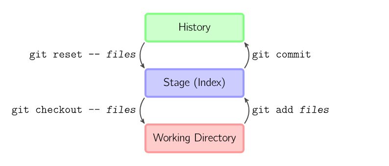

# [Draft] 4 树对象和提交对象

!!! abstract
    上一章我们讨论了 git 如何处理单个的文件。这章中，我们会了解到 git 如何处理一个目录，以及如何将目录的状态保存到 git repo 中。

    这章中，我们会实现：
    - TODO

## 4.1 预备知识

### 4.1.1 树对象

在上一章中，我们讨论了 blob 这个对象类型的存储方式。我们提到，blob 对象包含了一个文件的内容，但是并不包含文件路径等信息。因此，仅仅是 blob 对象并不足以刻画和还原一个仓库的状态。

事实上，git 通过「树 (tree) 对象」来描述一个仓库的状态。树对象中包含了模式、类型、文件名等信息。不妨直接看个例子！

<!-- termynal: {"prompt_literal_start": ["%"], title: "", buttons: macos} -->
```
% git cat-file -p main^{tree}  
100644 blob 567994ceb193ad3c00ebec195c7a702c2223826e    .gitignore
100644 blob efa312a9fe09c9d1995b9ef3ac4dd001baa04897    readme.md
040000 tree 4ac134baee324779055a2f920bd27f21b8a4ad3b    scripts
100644 blob 19bb2f232819b48dace673d19c62e61d284e17fc    setup.py
040000 tree fa87295799e0c8a99ed4df60b330a805deb6822a    xgit
```

这里 `-p` 表示 `--pretty`，即按照对象的类型，以人类可读的方式打印对象的内容。`main^{tree}` 表示 `main` 分支上最新提交所指向的树对象，我们会稍后详细介绍提交的具体逻辑。

这里的输出有 4 列，依次表示模式 (file mode)、类型、对象的 hash 值和名字。可以看到，这里有两个 blob 对象，一个树对象和一个目录对象。

可以看到，树对象中包含了 4 个 blob 对象和 2 个树对象。其中，`scripts` 和 `xgit` 是两个目录，因此它们对应的对象类型是 `tree`；而 `readme.md` 和 `setup.py` 是两个文件，因此它们对应的对象类型是 `blob`。

对于 file mode，git 中主要有 5 种类型：
- 普通文件：`100644` 表示不可执行的普通文件，`100755` 表示可执行的普通文件；
- 符号链接：`120000` 表示符号链接 (symlink, symbolic link, a.k.a. soft link | 软连接)；
- 目录：`040000` 表示目录；
- gitlink：`160000` 表示 gitlink，即子模块 (submodule)。

???+ tip "符号链接"
    符号链接，也称为软连接，是一种特殊的文件类型。它的内容是一个路径，当我们访问这个文件时，系统会将我们重定向到这个路径所指向的文件。

    例如，我们可以使用 `ln -s a a_symlink` 来创建一个符号链接，它指向 `a` 这个文件：

    ```
    % echo "123" > a
    % ln -s a a_symlink
    % ls -lh
    total 4.0K
    -rw-rw-r-- 1 dev dev 4 Jan  2 14:19 a
    lrwxrwxrwx 1 dev dev 1 Jan  2 14:20 a_symlink -> a
    % cat a_symlink
    123
    % readlink a_symlink
    a
    ```

    用 `ls -l` 可以看到，`a_symlink` 的 permission string 是 `lrwxrwxrwx`，这里的第一个字符 `l` 表示这个文件是一个 symlink；在后面我们也可以看到它事实上是指向 `a_symlink -> a` 的。

    当我们 `cat a_symlink` 的时候，系统会将我们重定向到 `a` 这个文件，因此我们看到的是 `a` 的内容。当我们 `readlink a_symlink` 的时候，我们能看到 `a_symlink` 指向文件，这事实上也是 `a_symlink` 这个文件本身的内容。

    我们可以使用 `ln -s /tmp/xyx0102/a a_symlink_abs` 创建一个指向绝对路径的符号链接：

    ```
    % ls -lh
    total 4.0K
    -rw-rw-r-- 1 dev dev  4 Jan  2 14:19 a
    lrwxrwxrwx 1 dev dev  1 Jan  2 14:20 a_symlink -> a
    lrwxrwxrwx 1 dev dev 14 Jan  2 14:21 a_symlink_abs -> /tmp/xyx0102/a
    ```

    注意看第 5 列，`a_symlink` 的大小是 1B，而 `a_symlink_abs` 的大小是 14B，这和它们的内容（即指向的文件的路径这个字符串）的长度是一致的。

    指向相对路径和绝对路径的符号链接有什么区别呢？如果我们将当前目录移动到另一个位置，`a_symlink` 仍然能够指向 `a` 这个文件；但是 `a_symlink_abs` 就不行了，因为它指向的是 `/tmp/xyx0102/a`，而这个文件已经不存在了。类似地，如果我们不移动 `a`，而只移动两个符号链接，那么 `a_symlink_abs` 仍然能够指向 `a`，但是 `a_symlink` 就不行了。

    因此，如我们刚才所说的那样，符号链接仍然还是一个文件。所以 git 在处理它时，也会将它看作一个 blob 对象；其 SHA 值也是由它的内容决定的。

对于上面一个具体的树对象，它也可以通过类似地方式查看内容：

<!-- termynal: {"prompt_literal_start": ["%"], title: "", buttons: macos} -->
```
% git cat-file -p fa87295799e0c8a99ed4df60b330a805deb6822a
100644 blob e69de29bb2d1d6434b8b29ae775ad8c2e48c5391    __init__.py
100644 blob f01ed6f00183801a41b97b94d34fa6a88f08b78f    cli.py
040000 tree ab23095a203b7d5427a34e6bd67e29cdd955a85d    commands
100644 blob ba652e6c821887b83988d12a5de03b85d0314976    constants.py
100644 blob 5203a0a1944c62265ae663c8b12bdf4d3ee20b57    utils.py
```

这样，我们就看到 `xgit` 这个目录下的内容了。可以看到，它包含了 4 个 blob 对象和 1 个树对象。用类似的方式，我们也可以看到 `commands` 这个目录下的内容。也就是说，树对象如它的名字一样，刻画出了一个目录的结构。

为什么需要 `-p` 呢？请回顾上一节我们 `cat-file` 的实现，我们只是简单地将对象的内容打印出来了。如果我们直接打印它，会得到下面这样的结果：

<!-- termynal: {"prompt_literal_start": ["%"], title: "", buttons: macos} -->
```
% git cat-file tree fa87295799e0c8a99ed4df60b330a805deb6822a
100644 __init__.py�⛲��CK�)�wZ���S�100644 cli.py�����A�{��O����40000 commands�# Z ;}T'�Nk�~)��U�]100644 constants.py�e.l���9��*]�;��1Iv100644 utils.pyR���Lb&Z�cȱ+�M>�
                             W                                                                                                        
% xgit cat-file tree fa87295799e0c8a99ed4df60b330a805deb6822a
100644 __init__.py�⛲��CK�)�wZ���S�100644 cli.py�����A�{��O����40000 commands�# Z ;}T'�Nk�~)��U�]100644 constants.py�e.l���9��*]�;��1Iv100644 utils.pyR���Lb&Z�cȱ+�M>�
                             W
```

这就不得不谈到 git 对于树对象的内容的组织方式了。我们上一节提到，一个对象的存储方式是 `[type] 0x20 size 0x00 content`；而对于树对象，它的 content 是由多个 `[file mode] 0x20 [file name] 0x00 [hash]` 前后连接组成的。因此，我们上面看到的乱码一样的东西，其实是这里的 `[hash]`，因为他们是 20 个字节的二进制数据，并不一定都是可打印字符。

也是因此，当任意一级子目录中的文件发生变化时，其哈希值会变化；由于它的哈希值是所在目录对应的树对象内容的一部分，因此影响了其这个树对象的哈希值
；这进一步会影响整个 work-tree 对应的树对象的哈希值。因此，给定任何一个树对象的哈希值以及对象存储，我们都可以还原出整个仓库的状态。

### 4.1.2 暂存区 (stage / index)

在本地仓库中，我们会对文件进行一些修改。每当我们完成了一个阶段目标，我们会通过 `git add files` 的方式将我们的修改添加到暂存区 (stage, a.k.a. index) 中，然后通过 `git commit` 的方式将暂存区中的内容提交到 git repo 中。也就是说，这里总共有 3 个东西：本地工作目录、暂存区和 git repo，它们以如下方式交互：

<figure markdown>
  
  <figcaption markdown>git 的基本用法 | [src](https://marklodato.github.io/visual-git-guide/index-zh-cn.html)</figcaption>
</figure>


???+ tip "文件的状态变化"
    在 git 和用户的视角里，每一个文件的状态变化如下图所示：

    <center></center>

    下面对这张图做详细的解释。

    ---

    我们使用下面这样的形式来刻画 git 仓库 (repo)、暂存区 (index / stage) 和本地工作目录 (work-tree) 的状态。可以看到，main.py 在三个位置都存在，说明这个文件曾经被 commit 过。我们用 `(1)` 来描述文件的版本；这三个地方 main.py 的版本一致，这说明这个文件在提交之后未被修改过：

    ```
       repo          index        work-tree
    ----------     ---------      ---------
    main.py(1)     main.py(1)     main.py(1)
    ```

    ---

    我们可能会添加一些文件；对于我们没有 `git add` 过的文件，它们的状态是「未跟踪 (untracked)」的：git 并不知道这些文件是否被更改过，因为它从来没有存储过这些文件的状态信息；即从来没有用 `git hash-object -w` 把它们写入到对象存储过：

    ```
       repo          index        work-tree
    ----------     ---------      ---------
                                  README.md(1)
    main.py(1)     main.py(1)     main.py(1)
    ```

    ---

    当我们使用 `git add` 将文件添加到暂存区时，git 会为这个文件的内容生成一个 blob，然后将它写入到 stage 的 tree 中。因此它的状态变为「已暂存 (staged)」；这意味着 git 已经记住了这次修改，并把它加入到了暂存区——git 有能力对这个文件的后续修改进行跟踪：

    ```
       repo          index        work-tree
    ----------     ---------      ---------
                   README.md(1)   README.md(1)
    main.py(1)     main.py(1)     main.py(1)
    ```

    ---

    当我们在本地对已跟踪的文件进行修改后，它们的状态变为「已修改 (modified)」，因为 git 发现了本地的版本和暂存区的版本并不相同。
    
    ```
       repo          index        work-tree
    ----------     ---------      ---------
                   README.md(1)   README.md(2)
    main.py(1)     main.py(1)     main.py(1)
    ```
    
    但事实上，此时 README.md 是「已修改」的的同时，它也是「已暂存」的；准确地来说，README.md(1) 是「已暂存」的，而 README.md(2) 是「已修改」的：
    
    

    ???+ tip "`git status`"
        `git status` 会告诉我们 3 种「变动」：
        
        - `Changes to be committed`：暂存区与 repo 的差异
        - `Changes not staged for commit`：已跟踪的文件中，工作目录与暂存区的差异
        - `Untracked files`：工作目录中未跟踪的文件

        在本节的例子中，我们会看到全部这三个种类。

    ---

    当我们使用 `git add` 将已修改的文件添加到暂存区后，它们的状态再次变为「已暂存 (staged)」。

    ```
       repo          index        work-tree
    ----------     ---------      ---------
                   README.md(2)   README.md(2)
    main.py(1)     main.py(1)     main.py(1)
    ```

    ---

    当我们使用 `git commit` 将暂存区的内容提交到 git repo 时，实际上我们是使用 index tree 的内容构建了一个 commit object，将它写入到仓库中（我们稍后会详细讨论这些细节）。因此，它们的状态变为「已提交 (committed)」，因为 git 将暂存区的内容写入到了 git repo 中。此时，git repo 中的内容和暂存区的内容相同，而 work-tree 的状态与它们也一样，因此它也是「未修改 (unmodified)」的。已提交和未修改是等价的状态。

    ```
       repo          index        work-tree
    ----------     ---------      ---------
    README.md(2)   README.md(2)   README.md(2)
    main.py(1)     main.py(1)     main.py(1)
    ```

    ???+ tip

        当然，如果我们在 `git commit` 时处在以下状态：

        ```
           repo          index        work-tree
        ----------     ---------      ---------
                       README.md(1)   README.md(2)
        main.py(1)     main.py(1)     main.py(1)
        ```

        在我们提交后，repo 变得和 index 一样，但 work-tree 的 README.md 与前二者的版本并不同，因此 README.md 的状态仍然是「已修改」：

        ```
           repo          index        work-tree
        ----------     ---------      ---------
        README.md(1)   README.md(1)   README.md(2)
        main.py(1)     main.py(1)     main.py(1)
        ```

        

    ---

    我们还可以通过 `git rm` 将文件从暂存区删除；

    ```
       repo          index        work-tree
    ----------     ---------      ---------
    README.md(2)                  README.md(2)
    main.py(1)     main.py(1)     main.py(1)
    ```

    此时，README.md 的状态变回「未跟踪」，因为 index 中已经没有 README.md 了，因此不知道 README.md 是否被修改过：

    > 注：`git rm` 默认会从 index 和 work-tree 中删除文件；如果只想从 index 中删除，可以使用 `git rm --cached`：

    

    !!! quote "以上的内容的例子启发自 [这个回答](https://stackoverflow.com/a/55878249/14430730)。"

### 4.1.3 提交对象

Blob 类型的对象实现了「存储文件内容」的功能，获得了文件的快照；tree 类型的对象在此之上实现了「存储目录结构（路径、模式）」的功能，获得了 work-tree 的快照。而在此之上，commit 类型的对象则维护了「谁、在什么时候、出于何种目的保存这些快照」的信息，从而以人类可读和可追溯地方式记录了仓库的变化——或者说，用人类的语言标记了一些 tree 对象的 SHA。

看两个例子：

<!-- termynal: {"prompt_literal_start": ["%"], title: "", buttons: macos} -->
```
% git cat-file -p 1a4e1286c25459fae80c8031fa68a2bf349efc5b
tree 8b950fd0e5045a016754832f0034ea87a66c2995
author smd1121 <2087868649@qq.com> 1701586413 +0800
committer smd1121 <2087868649@qq.com> 1701586413 +0800

[feat][framework]: basic install & run codes
% git cat-file -p 2d4a22863bad3835a0da2f8eedb66335b8390bb8
tree 08d60cce73001ec2042755b380bd08b1b08c9329
parent 1a4e1286c25459fae80c8031fa68a2bf349efc5b
author smd1121 <2087868649@qq.com> 1701596360 +0800
committer smd1121 <2087868649@qq.com> 1701607564 +0800

[feat][command] implements init
```

`1a4e1286c25459fae80c8031fa68a2bf349efc5b` 是这个仓库的首个提交。它的内容包含了一个 tree 对象的 SHA，以及作者 (author) 和 提交者 (committer) 的信息，同时还有一个提交信息 (commit message) 表示这个提交干了什么。

Commit 的作者和提交者可能不是同一个人，例如 [这个 commit](https://github.com/IsshikiHugh/zju-cs-asio/commit/34e0e297a4c421d22b644d7fbe0757da9a658593) 作者是我，但是提交者是修勾 @IsshikiHugh。

而 `2d4a22863bad3835a0da2f8eedb66335b8390bb8` 是第二个提交，可以看到它多了一个 parent 字段，表示它是基于哪个提交之上修改的；这里的 parent 就是 `1a4e1286c25459fae80c8031fa68a2bf349efc5b`。

一个提交可能没有 parent（例如第一个提交），也可能有多个 parent（例如 merge commit）。也是因此，我们可以从任意一个提交开始，通过 parent 字段一直追溯到第一个提交，从而还原出整个仓库的变化；而由于每个提交都包含了 tree sha，我们也可以还原出任何一个提交的快照。也就是说，这让仓库的全部历史都保存在每一个 commit 里。（所以 git 其实也是区块链。）

## 4.2 效果

能够通过 `cat-file -p` 查看树对象和提交对象的内容。

## 4.3 我的实现

不会完全显示出来，使用的是 `less` 这个命令行工具。这是一个分页器。

````python
import typer
import subprocess

app = typer.Typer()

@app.command()
def show_data():
    # 生成或获取要显示的数据
    data = "这里是您的数据...\n" * 100  # 示例数据

    # 使用分页器显示数据
    with subprocess.Popen(['less'], stdin=subprocess.PIPE, text=True) as proc:
        proc.communicate(data)

if __name__ == "__main__":
    app()
````
